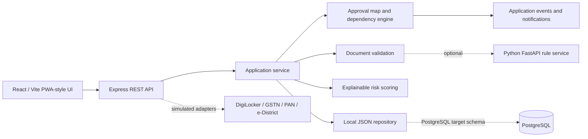
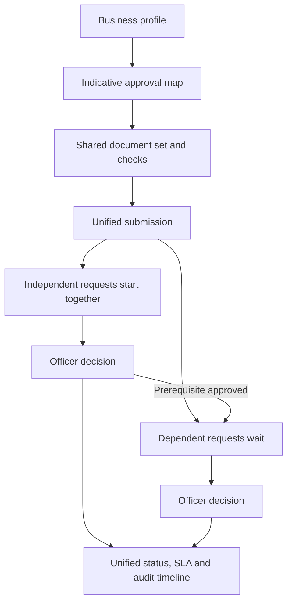

# Udyog Setu

**One platform. Every approval. Zero guesswork.**

Smart India Hackathon 2026 · SIH26130 · A runnable sandbox for Maharashtra industrial approval orchestration.

## The problem and the solution

Industrial entrepreneurs face fragmented departmental requirements, repeated document submissions, and poor visibility into timelines. Udyog Setu collects a business profile once, generates an indicative approval map, checks documents before submission, starts independent approval routes in parallel, and gives applicants and officers one shared status timeline.

The visual design was adapted from the supplied **Udyog Setu — Single-Window Approvals.html**. Its navy, teal, amber, and warm neutral visual language is preserved in a responsive React interface.

## Run the demo

Requirements: Node.js 20+, npm. PostgreSQL and Python are optional.

```powershell
npm install
npm --prefix backend install
npm --prefix frontend install
npm run seed
npm run dev
```

Open **http://localhost:5173**. The API runs at **http://localhost:4000**. Choose **Entrepreneur**, **Officer**, or **Admin** on the landing page. One-click demo sign-in is intended only for this local prototype.

Demo account credentials, if using the login API directly: `entrepreneur@demo.udyogsetu.in`, `officer@demo.udyogsetu.in`, or `admin@demo.udyogsetu.in`; password `Demo@2026`.

### Five-minute judge journey

1. Enter **Entrepreneur demo** and select **GreenForge Manufacturing Pvt. Ltd.** if needed.
2. Open **Document center**. The seeded Factory Layout Plan has a mismatched business name and lacks a fire exit. Expand the checks.
3. Select **Use valid demo sample** on that card. The rule checks turn green. You can also upload a real `.txt`, `.pdf`, `.png`, or `.jpg` file (8 MB maximum).
4. Submit the unified application. The workflow page shows independent routes starting together; Fire NOC and factory licence wait for factory-plan approval.
5. Switch to **Officer demo**, open a review, inspect the document and risk factors, then approve, reject with reason, or request documents.
6. Switch back to **Entrepreneur demo**. The dashboard and event timeline refresh from the shared API state. Switch to **Admin demo** for analytics and the clearly labeled time-savings simulation.
7. **SIH presentation** offers a ten-step guided narration.

Run `npm run seed` to reset the sandbox to its initial state before a live demonstration. This replaces local demo data.

## Architecture



The running prototype persists applications to `backend/data/store.json` and uploaded files to `backend/uploads/`. The schema in [`database/schema.sql`](database/schema.sql) maps the same entities to PostgreSQL for a future adapter. No PostgreSQL server is required for the judge demo. The local event list is append-only by application action; it is **not blockchain-backed**.

The optional Python service uses explicit rules, not a trained classifier. Start it with:

```powershell
python -m pip install -r ai-service/requirements.txt
python -m uvicorn main:app --app-dir ai-service --port 8000
```

Set `AI_SERVICE_URL=http://localhost:8000` for the API to use it during upload. If it is unavailable, the same TypeScript rules keep the demo functional. A PDF or image is checked by filename and metadata only and is flagged **Officer review**; no OCR or issuer verification is claimed. Text files receive keyword, business-name, PAN-format, and fire-exit checks as applicable.

## Workflow and security



JWT sessions, hashed demo passwords, role-based API guards, Zod input checks, upload MIME and size limits, and append-only application events are implemented. This is **prototype security**: one-click role access, local file storage, and a default local secret are unsuitable for public deployment. Set `JWT_SECRET` before any deployment and replace one-click demo access with real identity and officer department assignment.

The risk score is the sum of visible points for document gaps, industry, environmental impact, investment, and approval dependencies. Low risk may be marked **eligible for provisional processing consideration**; it does not confer legal approval. Final decisions remain with authorized officers.

## Main REST routes

| Route | Purpose |
|---|---|
| `POST /api/auth/demo`, `POST /api/auth/login` | Sandbox role entry and credential login |
| `POST /api/applications`, `GET /api/applications/:id` | Create and read applications |
| `POST /api/applications/:id/analyze` | Recompute draft approval map |
| `POST /api/documents/upload`, `GET /api/documents/:id/file` | Store and review documents |
| `POST /api/applications/:id/submit` | Validate required documents and start parallel routes |
| `POST /api/approvals/:id/approve` | Officer approval and dependency release |
| `POST /api/approvals/:id/reject` | Officer rejection with reason |
| `POST /api/approvals/:id/request-documents` | Officer query with reason |
| `GET /api/analytics`, `GET /api/schemes`, `GET /api/integrations` | Sandbox analytics, discovery, adapter status |

Errors return an `error` message intended for direct display. The frontend refreshes application state every 12 seconds and immediately after its own mutations.

## Verification

```powershell
npm run build
npm test
# With the API running:
node scripts/demo-smoke.mjs
```

The smoke script creates a disposable demo application, verifies that missing documents block submission, uploads each required text sample, submits, checks parallel starts, approves a prerequisite as an officer, and confirms the dependent route and entrepreneur view update.

## Limits and future scope

- All government integrations are **Prototype / Sandbox**. No live DigiLocker, GSTN, PAN, e-District, Aadhaar, or department API is used.
- Scheme cards are discovery prompts with demo data. Verify eligibility and current terms with official government sources.
- The `~36 → ~18 days` and `~50%` figures are a **prototype simulation based on configured workflow assumptions**, not measured results.
- The language switcher translates core navigation in English, Marathi, and Hindi; the complete content translation remains future work.
- Production work would add verified official integrations, OCR/issuer checks, department-scoped officer accounts, a PostgreSQL repository, strong file scanning, secure object storage, and measured SLA calibration.
